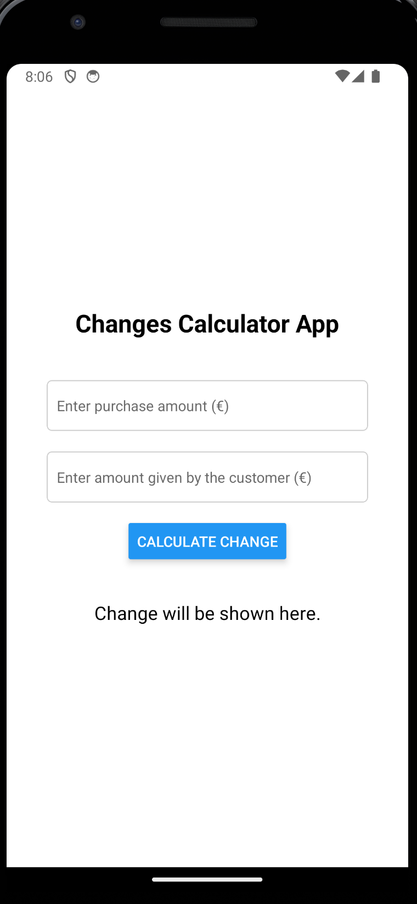
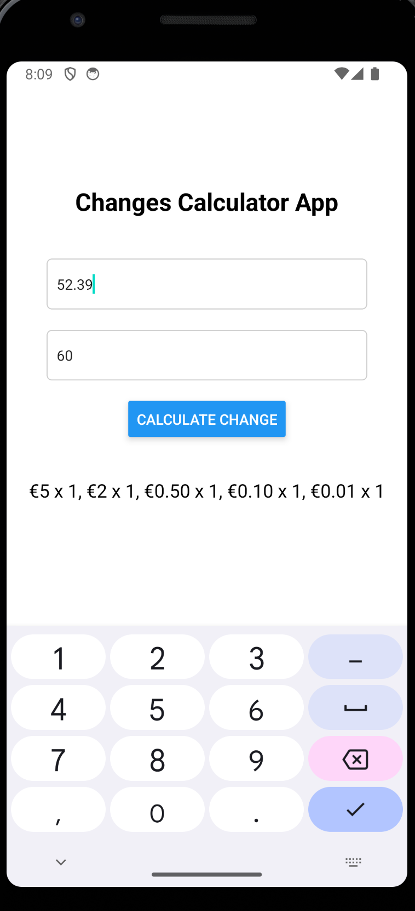

# Changes Calculator App


The goal of this project is to create a changes calculator app, that will be able to run on the Web, Android and iOS devices.<br>
To achieve this, we will use [React-Native](./docs/ABOUT_REACT_NATIVE.md) and Typescript.

## Description

[===> Check the full description of this task by clicking here.](./docs/TASK_CHANGES_CALCULATOR_APP.md)

## Starting the development

For the development of this project, let's consider:
- Node: v18.18.0 (npm v9.8.1)

If you don't have this specific node version, you can try with your own version, or you can install it with the Node Version Manager (NVM): `nvm use 18.18.0`.<br>
If you don't have **nvm** to perform this action, please check these websites:
- https://www.freecodecamp.org/news/node-version-manager-nvm-install-guide/
- https://github.com/nvm-sh/nvm
- https://github.com/coreybutler/nvm-windows (windows)

Open a terminal and create the initial structure of this project with [Expo Go](https://docs.expo.dev/) by running:

```
npx create-expo-app -t expo-template-blank-typescript ChangesCalculatorApp
```

Enter in the project folder and let's install some dependencies to also run on the web, so we can easily validate in our browser:

```
cd ChangesCalculatorApp
npx expo install react-native-web@~0.19.6 react-dom@18.2.0 @expo/webpack-config@^19.0.0
```

Start the application, it will ask you to press one letter if you want to open on Android (a), iOS Simulator (i) or on the web (w). Press **w** to open the browser (you can directly execute in the web with `npm run web` if you prefer):

```
npx expo start
```

You will see the message on your browser: `Open up App.tsx to start working on your app!`<br>
If you want to execute on **Android** or **iOS** devices, you'll need extra configurations.<br>
For example, let's try instead of pressing **w** to show in the browser, let's press **a** to open for Android.<br>
You'll see some error message like:
```
Failed to resolve the Android SDK path. Default install location not found: /Users/abcdefg/Library/Android/sdk. Use ANDROID_HOME to set the Android SDK location.
```
If you want to set up for **Android**, follow the steps here: [https://docs.expo.dev/workflow/android-studio-emulator/](https://docs.expo.dev/workflow/android-studio-emulator/). It will guide you to install **Android Studio**, set your Android SDK location to an environment variable, and have an Android Virtual Device so you don't need to have an Android smartphone to test your changes. However, if you prefer, you can also **run on your own device** and check the changes directly on your smartphone! You can achieve that by following the instructions here: [https://reactnative.dev/docs/running-on-device?platform=android](https://reactnative.dev/docs/running-on-device?platform=android).


So, let's start working in our **App.tsx**!

_PS_: if you see some error message like this, it is normal for the first time, because we didn't have anything in [cache](https://en.wikipedia.org/wiki/Cache_(computing)) at this moment: 
```
Error while reading cache, falling back to a full crawl:
 Error: Unable to deserialize cloned data due to invalid or unsupported version.
    at deserialize (node:v8:345:7)
    ...
```

## The App.tsx

Before we start making changes in our main file, let's take a look into it's content:

```ts
import { StatusBar } from 'expo-status-bar';
import { StyleSheet, Text, View } from 'react-native';

export default function App() {
  return (
    <View style={styles.container}>
      <Text>Open up App.tsx to start working on your app!</Text>
      <StatusBar style="auto" />
    </View>
  );
}

const styles = StyleSheet.create({
  container: {
    flex: 1,
    backgroundColor: '#fff',
    alignItems: 'center',
    justifyContent: 'center',
  },
});
```

If you are familiar with [React](https://react.dev/learn), you'll see the structure is basically the same.<br>
This code defines a function called **App** that will be the entrypoint for building our main app. It also defines some basic CSS to our app.<br>
Feel free to do changes and try to implement the app by yourself looking at the documentation and other websites that can help you achieve that, or you can continue with this tutorial to create this app together.

### Giving some shape to our App

Let's start by changing what we are going to show. First, do this small change to our `App.tsx`, keeping the previous imports and the style defined there:

```ts
// other imports
import { ChangeCalculator } from './src/ChangeCalculator';

export default function App() {
  return (
    <View style={styles.container}>
      <ChangeCalculator />
    </View>
  );
}
// ...
```

This code won't run because we didn't create the `ChangeCalculator` component yet. We are going to create it into a folder called `src` (short for _source_), where we are going to have the logic for our app. You can see that now, instead of displaying a message, the `View` will have inside just a call to `ChangeCalculator` component.

#### ChangeCalculator.tsx

Create a folder called `src` and a file named `ChangeCalculator.tsx`. Assuming you have your terminal at the root of your new project:

```bash
mkdir src && touch src/ChangeCalculator.tsx
```

Add its content:

```ts
import React, { useState } from 'react';
import { StyleSheet, Text, TextInput, Button } from 'react-native';
import { Breakdown } from './Breakdown';
import { EURO_DENOMINATIONS } from './Denomination'

const breakdownCalculator = new Breakdown(EURO_DENOMINATIONS);

export function ChangeCalculator() {
  const [purchaseAmount, setPurchaseAmount] = useState<string>('');
  const [amountGiven, setAmountGiven] = useState<string>('');
  const [changeResult, setChangeResult] = useState<string>('Change will be shown here.');

  const handleCalculateChange = () => {
    const purchase = parseFloat(purchaseAmount);
    const given = parseFloat(amountGiven);
    if (!isNaN(purchase) && !isNaN(given)) {
      const change = given - purchase;
      const breakdownDescription = breakdownCalculator.describeBreakdown(change);
      setChangeResult(breakdownDescription);
    } else {
      setChangeResult("Please enter valid amounts.");
    }
  };

  return (
    <>
      <Text style={styles.title}>Changes Calculator App</Text>
      <TextInput
        style={styles.input}
        keyboardType="numeric"
        placeholder="Enter purchase amount (€)"
        value={purchaseAmount}
        onChangeText={setPurchaseAmount}
      />
      <TextInput
        style={styles.input}
        keyboardType="numeric"
        placeholder="Enter amount given by the customer (€)"
        value={amountGiven}
        onChangeText={setAmountGiven}
      />
      <Button title="Calculate Change" onPress={handleCalculateChange}/>
      <Text style={styles.result}>{changeResult}</Text>
    </>
  );
}

const styles = StyleSheet.create({
    container: {
      flex: 1,
      backgroundColor: '#f2f2f2',
      alignItems: 'center',
      paddingTop: 50,
    },
    title: {
      fontSize: 24,
      marginBottom: 40,
      fontWeight: 'bold',
    },
    input: {
      width: '80%',
      padding: 10,
      marginBottom: 20,
      borderWidth: 1,
      borderColor: '#ccc',
      borderRadius: 5,
      backgroundColor: '#fff',
    },
    result: {
      marginTop: 40,
      fontSize: 18,
    },
  });
```

The main goal of this component is to define two input fields, a button to calculate and a text field to show the results.

We are using `useState` to control the values of our variables. When calling this function, it also gives us a `set` method for the variable we want to keep track. In this code, we are keeping track of `purchaseAmount`, `amountGiven` and `changeResult`. The first two are updated from the values in the input text fields, and the latest is updated when the "Calculate Change" button is pressed.

We can see from the code some modules are still missing, let's create them!

#### Denomination.tsx

This file will define the available denominations. For now, we will define only EUR currency:

```bash
touch src/Denomination.tsx
```

And its content:

```ts
export type Denomination = {
    name: string;
    value: number;
};

export const EURO_DENOMINATIONS: Denomination[] = [
    { name: '€500', value: 500 },
    { name: '€200', value: 200 },
    { name: '€100', value: 100 },
    { name: '€50', value: 50 },
    { name: '€20', value: 20 },
    { name: '€10', value: 10 },
    { name: '€5', value: 5 },
    { name: '€2', value: 2 },
    { name: '€1', value: 1 },
    { name: '€0.50', value: 0.50 },
    { name: '€0.20', value: 0.20 },
    { name: '€0.10', value: 0.10 },
    { name: '€0.05', value: 0.05 },
    { name: '€0.02', value: 0.02 },
    { name: '€0.01', value: 0.01 }
];
```

The code above defines the `Denomination` type and the `EURO_DENOMINATIONS` that we will use to calculate the breakdown.

#### Breakdown.tsx

Let's define the Breakdown class that will contain the method to perform the breakdown.

```bash
touch src/Breakdown.tsx
```

And its content:

```ts
import { Denomination } from './Denomination';

export class Breakdown {
  private denominations: Denomination[];

  constructor(denominations: Denomination[]) {
    this.denominations = denominations.sort((a, b) => b.value - a.value); // ensure it's sorted in descending order
  }

  public describeBreakdown(changeAmount: number): string {
    let remaining = changeAmount;
    const breakdown: string[] = [];
    for (const denomination of this.denominations) {
      const count = Math.floor(remaining / denomination.value);
      if (count > 0) {
        breakdown.push(`${denomination.name} x ${count}`);
        remaining = Number((remaining - count * denomination.value).toFixed(2));
      }
      if (remaining == 0) {
        break;
      }
    }
    return breakdown.join(', ');
  }
}
```

Why did we define a class for this? In short, it is really not needed. However, if you pay attention, it ensures to sort all denominations, in descending order, when it is instantiated. So, when calling `describeBreakdown`, we can be sure that this will perform trying all the higher denominations first, giving the best combination for the change.

### Running the first version of our App

Running `npm start` (_and in my case selecting to open Android_), you can see that it is working!




Now, try to improve the output, add new features, more currencies, ... it is up to you! :)

### Adding a Splash Screen to Welcome users - Dealing with Life Cycles of an App

It is common to show the so called "Splash Screen" when an app is initializing. Normally, you would be starting necessary services in the background, and when they are finished, you would show the main screen of your app.

In our case, let's just explore the Life Cyles:
- We would like to show the "Welcome \o/" message when the App starts for the `first time`;
- We would like to show the "Resuming" message when the App is `resumed` - this happens if the user changes to another app, then our app goes to "stand by" mode. When the user selects our app again, it is resumed.

Since `App.tsx` is the main module of our app, let's modify it to be:

```ts
import React, { useEffect, useState } from 'react';
import { AppState, StyleSheet, Text, View } from 'react-native';
import { ChangeCalculator } from './src/ChangeCalculator';

export default function App() {
  const [isSplashVisible, setSplashVisibility] = useState(true);
  const [appState, setAppState] = useState(AppState.currentState);

  const handleAppStateChange = (nextAppState: "active" | "background" | "inactive" | "unknown" | "extension") => {
    if (
      appState.match(/inactive|background/) &&
      nextAppState === 'active'
    ) {
      setSplashVisibility(true);
      setTimeout(() => {
        setSplashVisibility(false);
      }, 2000);
    }
    setAppState(nextAppState);
  };


  useEffect(() => {
    // This will deactivate ou Splash Screen after 2 seconds
    const timer = setTimeout(() => {
      setSplashVisibility(false);
    }, 2000);

    // This line sets up an event listener to listen for changes in the app's state. When the app's state changes (e.g., it 
    // goes to the background or comes back to the foreground), the handleAppStateChange function will be called.
    const appStateSubscription = AppState.addEventListener('change', handleAppStateChange);

    // Cleanup function of the useEffect hook:
    // Clean up any side effects to avoid memory leaks or unwanted behavior. Here, the timer is cleared (to ensure 
    // it doesn't run if it hasn't already) and the app state event listener is removed (to stop listening for 
    // app state changes).
    return () => {
      clearTimeout(timer);
      appStateSubscription.remove();
    };
  }, [appState]); // Our dependency array: Whenever appState changes, the effect will re-run, and before it does, it will run  the cleanup function.

  return (
    <View style={styles.container}>
      {isSplashVisible ? (
        <View style={styles.splashScreen}>
          <Text style={styles.splashText}>Welcome \o/</Text>
        </View>
      ) : (
        <ChangeCalculator />
      )}
    </View>
  );
};

const styles = StyleSheet.create({
  container: {
    flex: 1,
    backgroundColor: '#fff',
    alignItems: 'center',
    justifyContent: 'center',
  },
  splashScreen: {
    flex: 1,
    justifyContent: 'center',
    alignItems: 'center',
    backgroundColor: 'white',
  },
  splashText: {
    fontSize: 30,
    color: 'deepskyblue',
  },
});
```

The code above keeps track of two variables `isSplashVisible` and `appState`. The first one controls the visibility of our Splash Screen and starts with value _true_, and the second one keeps track of the current state of our app. In order to keep track of the current state of our App, we need to add a `listener`. But where to add this listener? The answer is to use `useEffect`.

The [useEffect hook](https://react.dev/reference/react/useEffect#useeffect) is a part of React's Hooks API. It lets you perform side effects in functional components. The useEffect hook receives two arguments:

1. A function where you place the code to run.
2. A dependency array.

The code inside the function will run after the component renders, and it will re-run every time a value in the dependency array changes. If you don't provide a dependency array, the code will run after every render. If you provide an empty dependency array ([]), the code will run once after the initial render. 

Some additional comments were added to the code snippet above so you can understand what is going on in our `useEffect` code. In short, it will be responsible of keeping track and updating our `appState`, and depending the state our app is, it will change `isSplashVisible` accordingly.

Now, if you open the app, you should be able to see the welcome message when opening the App for the first time or resuming it. However, this will always display only the "Welcome \o/" message. Try to modify this code so you can display a different message when it is resuming. Also, try to add some image, gif or video to it, instead of a simple plain message. It is up to you! :)

### Miscellaneous 

#### Functional programming to define components

You saw how to defined components declaring them as functions:

```ts
function ChangeCalculator() {
  // code here
}
```

You can use write in a functional programming style instead, that is equivalent:

```ts
const ChangeCalculator: React.FC = () => {
  // code here
}
```

The functional programming style is preferred among React developers. <br>


Copyright © 2023 Daniel Freitas Martins (dnlfm)